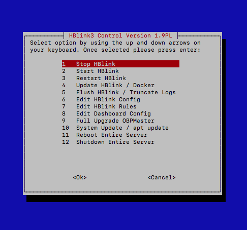

# HBlink3 Docker Installer
STILL IN DEVELOPMENT!!!!
FIXING ISSUES
=======
Development branch for version 2 (Dockerised HBMonv2)
This is a multi-arch docker installer for HBlink3 and HBmonV2 combined for Debian 10 / 11


## Additional Features
### NEW! Parrot built in
Parrot is built into this install (Default disabled, see below how to enable the parrot feature!

### Docker Multi-Arch build
Docker container pre-built for multi-arch!

* x86_64
* armv6 / armv7
* aarch64
* ppc64
* lots more!

This installer builds the entire server! It includes all of the dependencies needed to run HBlink3 within docker via docker-compose. The install also includes
HBMonv2 which is a dashboard designed for HBlink3 by SP2ONG! This runs side by side, but at this time runs on the host machine. HBMonv2 is controlled by a system unit file which runs the python code on the host.

This installer includes all the usual libs and packages including docker, apache2, php and python3. It is recommended that you 
install this on a 'clean machine'. The script is destructive and is not designed to be used on an exisiting machine! YOU HAVE 
BEEN WARNED!

### Prerequisite
System must be dabian 10 or 11. It is advisable to run HBlink on the latest debian platform. This script has been tested on most architectures but the system requires, at a minimum, 1 core, 512mbmb of ram, the required spec to run docker and additional procceses! The system must be up-to-date and have Git installed. You can install Git from the CLI.

Note* If you get Locale error(s) (LC_CTYPE=UTF-8, which is wrong) can happen when you login over ssh from a Mac to a linux box, and your terminal automatically sets environment variables. There's a checkbox for that. Uncheck it, and you're good to go.

Make sure your system is up-to-date and pull Git from the apt repo.
```sh
apt-get install -y git
```
### Installation
1. Have preferably a clean Dabian 10 or 11 system. Make sure your system is up to date with the latest apt repository database. You must be super user "root" to run this installer successfully.
```sh
apt update
sudo su
```
2. It is very important that the installer runs from the /opt directory! We will then want to get this repository and clone it to the /opt directory.
```sh
cd /opt
git clone https://github.com/ShaYmez/hblink3-docker-install
```
3. Now cd in to the cloned repo and execute the install script. No need to chmod as permissions are already satisfied.
```sh
cd hblink3-docker-install
./hblink3-docker-install.sh
```
4. follow the install and any prompts! It it will prompt you for kernel updates if neccassary.
5. Once the installation is complete it is recommended to reboot the machine.

### New Menu System released with this installer!



6. Once the installation is complete you will be guided to the Setup Menu. To interact with this menu follow the on-screen
instructions! Set up and configure your system with the new menu system! Once finihsed hit 'Finish Setup & Exit' to exit out of the
setup menu. Dont forget to reboot your machine!

7. To enter the HBlink control menu, type the command
```sh
hblink-menu
```
8. To interact with the routine scripts manually you can enter the comands directly without the use of the menu
```sh
hblink-start
hblink-stop
hblink-restart
hblink-flush
hblink-update
```

9. To interact with HBlink3 manually using docker you need to enter the HBlink3 directory
```sh
cd /etc/hblink3
```
10. You can only interact with HBlink3 in this directory. Use the following commands to interact with the installation. We use 
docker-compose to run the docker container!
```sh
docker-compose up -d
docker-compose down
docker-compose restart
docker-compose pull
sudo nano docker-compose.yml
```
11. Edit your configuration before deployment!
```sh
nano hblink.cfg
nano rules.py
```
12. Check the logs for errors!
```sh
docker container logs hblink
or
/var/log/hblink/hblink.log
```
10. Interact with HBMonv2 (Dashboard engine)
```sh
systemctl start|stop|restart|status hbmon
```


Within this installtion includes the new HBMonv2 by Weldek SP2ONG
* Better dashboard for monitoring per page
* Python build	
* Websocket connection to web interface	
* Can be easily secured by SSL / Websocket secure	
* Includes lastheard database with auto cron installed	
* Includes talkgroup html editable page	

## Easy Installation And Upgrade
The installation can be upgraded either by the use of a future scripts or by manually backing up your configuration and re-running the install script. Also the ability and really cool feature of docker-compose is that its easy to update the container with fresh images! Run by a simple command. Make sure you are in the /etc/hblink3 dir.
```sh
docker-compose pull
```
or 
```sh
hblink-update
```

## Ports to forward
```sh
http 80/tcp
https 443/tcp
report 4321/tcp
websocket 9000/udp
MMDVM 62030-62031/udp
OBP 62032-62050/udp
ssh 22/tcp
```
## Enable the Parrot
This installer comes with the parrot disabled. To enable the parrot follow commands below..
Asuming you are super user root!
```sh
nano /etc/hblink3/docker-compose.yml
```
Scroll down to the bottom of this compose file and look for ```- 'PARROT_ENABLE=0'```
Edit this to enable the Parrot master server which will be excuted upun restart
```sh
- 'PARROT_ENABLE=1'
```
Ctrl X and save!
Now lets enable the peer to connect to the master in our config...
```sh
nano /etc/hblink3/hblink.cfg
```
Scroll down to the ```[Parrot]``` stanza and edit ```ENABLED: True``` to enable.
Next we have put an example rule in rules.py. Remove the ```#``` hashes to enable routing of the parrot.
'''sh
nano /etc/hblink3/rules.py
```
Ctrl X and hit save!
Once done save this and enter the the HBlink control menu
```sh
hblink-menu
```
Select option 4 "Update HBlinlk / Docker
Watch the terminal for any errors while bringing up the project! You can use the parrot on TG9999 (Default) or edit for your own tastes!

### Postrequisite
Make sure you have properly configured your firewall!!! If using Vultr servers they come default with full firewall blockade! For initial testing
disable the firewall! 
```sh
ufw disable
``` 
### More to come...
We will be updating this repository to include more documentation. In the mean time learn about docker @ https://docker.com and visit the HBlink3 official repo for further documentation! https://github.com/HBLink-org/
